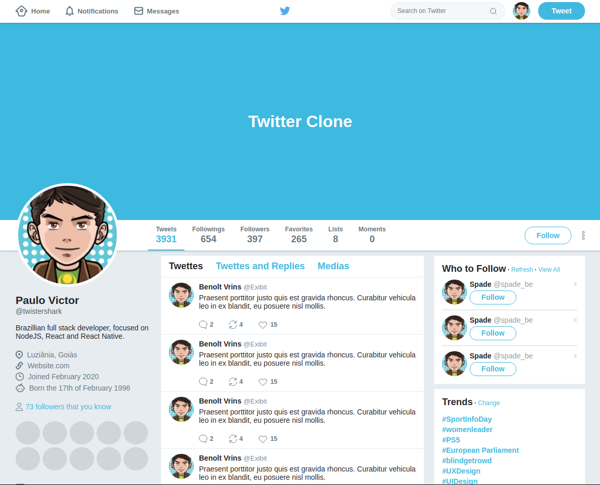

<h1 align="center">
  
</h1>

<h1 align="center">
  
</h1>

---
# 📑 Index

- [About](#-about)
- [Technologies](#-technologies)
- [Prerequisites](#-prerequisites)
- [How to use this project](#-how-to-use-this-project)
- [Contributing](#-contributing)
- [License](#-license)
---

## 📋 About

This is a simple **Twitter clone** to train **positioning** elements in CSS with **Flexbox**.

---

## 🚀 Technologies

- [HTML](https://developer.mozilla.org/pt-BR/docs/Web/HTML)
- [CSS](https://developer.mozilla.org/pt-BR/docs/Web/CSS)
- [Flexbox](https://developer.mozilla.org/pt-BR/docs/Web/CSS/CSS_Flexible_Box_Layout/Conceitos_Basicos_do_Flexbox)

---

## 🔧 Prerequisites

- None

---

## 🌟 How to use this project

```bash

  # Clone the repository
  $ git clone https://github.com/twistershark/twitter-clone

  # Enters the repository
  $ cd twitter-clone

  #start the project
  $ 'yourbrowsername' index.html

```

---
## 🤝 Contributing
Feel free to contribute to this project. Every help is welcome!

---
## 📃 License

This project is licensed under the MIT License - see the LICENSE.md file for details